# Tenancy Management System - Entity Relationship Diagram

## ER Diagram

```mermaid
erDiagram
    %% Core Entities
    USERS {
        int id PK
        string email
        string firstName
        string lastName
        string phoneNumber
        enum userType
        boolean isActive
        timestamp createdAt
        timestamp updatedAt
    }

    UNITS {
        int id PK
        int communityId FK
        int towerId FK
        string unitNumber
        string unitName
        enum unitType
        decimal area
        int bedrooms
        int bathrooms
        decimal rentAmount
        boolean isActive
        timestamp createdAt
        timestamp updatedAt
    }

    COMMUNITIES {
        int id PK
        string name
        string code
        string location
        string description
        boolean isActive
        timestamp createdAt
        timestamp updatedAt
    }

    TOWERS {
        int id PK
        int communityId FK
        string name
        string code
        int totalFloors
        int totalUnits
        boolean isActive
        timestamp createdAt
        timestamp updatedAt
    }

    %% Core Tenancy Entities
    TENANCY_RECORDS {
        uuid id PK
        int unitId FK
        int userId FK
        enum tenancyType
        enum status
        date startDate
        date endDate
        date terminationDate
        text terminationReason
        decimal refundAmount
        date transferDate
        text transferReason
        string smartFMId
        string smartFMRequestNumber
        text smartFMComments
        string processedBy
        timestamp processedAt
        text comments
        jsonb requestPayload
        jsonb responsePayload
        jsonb additionalData
        int createdBy FK
        int updatedBy FK
        timestamp createdAt
        timestamp updatedAt
        boolean isActiveRecord
    }

    TENANCY_RECORD_TENANT {
        uuid id PK
        uuid tenancyRecordId FK
        string firstName
        string lastName
        string email
        string dialCode
        string phoneNumber
        string nationality
        date dateOfBirth
        string emergencyContactDialCode
        string emergencyContactNumber
        int adults
        int children
        int householdStaffs
        int pets
        string emiratesIdNumber
        string passportNumber
        string visaNumber
        string powerOfAttorneyNumber
        string attorneyName
        string attorneyPhone
        string ejariNumber
        string dtcmPermitNumber
        string emergencyContactName
        string relationship
        text comments
        decimal monthlyRent
        decimal securityDeposit
        decimal maintenanceFee
        string currency
        int createdBy FK
        int updatedBy FK
        timestamp createdAt
        timestamp updatedAt
        boolean isActive
    }

    TENANCY_RECORD_OWNER {
        uuid id PK
        uuid tenancyRecordId FK
        string firstName
        string lastName
        string email
        string dialCode
        string phoneNumber
        string nationality
        date dateOfBirth
        string emergencyContactDialCode
        string emergencyContactNumber
        int adults
        int children
        int householdStaffs
        int pets
        string emiratesIdNumber
        string passportNumber
        string visaNumber
        string companyName
        string tradeLicenseNumber
        string companyAddress
        string companyPhone
        string companyEmail
        string powerOfAttorneyNumber
        string attorneyName
        string attorneyPhone
        string ejariNumber
        string dtcmPermitNumber
        string emergencyContactName
        string relationship
        text comments
        decimal monthlyRent
        decimal securityDeposit
        decimal maintenanceFee
        string currency
        int createdBy FK
        int updatedBy FK
        timestamp createdAt
        timestamp updatedAt
        boolean isActive
    }

    TENANCY_RECORD_HHO_COMPANY {
        uuid id PK
        uuid tenancyRecordId FK
        string companyName
        string tradeLicenseNumber
        string companyAddress
        string companyPhone
        string companyEmail
        string powerOfAttorneyNumber
        string attorneyName
        string attorneyPhone
        string ejariNumber
        string dtcmPermitNumber
        string emergencyContactName
        string relationship
        text comments
        decimal monthlyRent
        decimal securityDeposit
        decimal maintenanceFee
        string currency
        int createdBy FK
        int updatedBy FK
        timestamp createdAt
        timestamp updatedAt
        boolean isActive
    }

    TENANCY_RECORD_HHO_OWNER {
        uuid id PK
        uuid tenancyRecordId FK
        string ownerFirstName
        string ownerLastName
        string attorneyFirstName
        string attorneyLastName
        string email
        string dialCode
        string phoneNumber
        string nationality
        date dateOfBirth
        string emergencyContactDialCode
        string emergencyContactNumber
        int adults
        int children
        int householdStaffs
        int pets
        string emiratesIdNumber
        string passportNumber
        string visaNumber
        string powerOfAttorneyNumber
        string attorneyName
        string attorneyPhone
        string ejariNumber
        string dtcmPermitNumber
        string emergencyContactName
        string relationship
        text comments
        decimal monthlyRent
        decimal securityDeposit
        decimal maintenanceFee
        string currency
        int createdBy FK
        int updatedBy FK
        timestamp createdAt
        timestamp updatedAt
        boolean isActive
    }

    TENANCY_DOCUMENTS {
        uuid id PK
        uuid tenancyRecordId FK
        uuid fileUploadId FK
        enum documentType
        string documentName
        string documentNumber
        date issueDate
        date expiryDate
        string issuingAuthority
        enum status
        text remarks
        int verifiedBy FK
        timestamp verifiedAt
        text rejectionReason
        boolean isExpired
        boolean isExpiringSoon
        int version
        uuid previousVersionId FK
        int uploadedBy FK
        int updatedBy FK
        timestamp createdAt
        timestamp updatedAt
        boolean isActive
    }

    FILE_UPLOADS {
        uuid id PK
        string originalName
        string fileName
        string mimeType
        int fileSize
        string filePath
        string uploadPath
        boolean isPublic
        int uploadedBy FK
        timestamp createdAt
        timestamp updatedAt
        boolean isActive
    }

    %% Audit and Logging
    TENANCY_RECORD_LOGS {
        uuid id PK
        uuid tenancyRecordId FK
        enum action
        text description
        jsonb oldData
        jsonb newData
        int performedBy FK
        timestamp performedAt
        string ipAddress
        string userAgent
    }

    USER_ROLES {
        int id PK
        int userId FK
        enum roleName
        boolean isActive
        timestamp createdAt
        timestamp updatedAt
    }

    %% Relationships

    %% Community-Tower-Unit hierarchy
    COMMUNITIES ||--o{ TOWERS : "has"
    COMMUNITIES ||--o{ UNITS : "contains"
    TOWERS ||--o{ UNITS : "contains"

    %% Core Tenancy Relationships
    UNITS ||--o{ TENANCY_RECORDS : "has_tenancies"
    USERS ||--o{ TENANCY_RECORDS : "tenant_user"
    TENANCY_RECORDS ||--o{ TENANCY_DOCUMENTS : "has_documents"
    TENANCY_RECORDS ||--o{ TENANCY_RECORD_LOGS : "has_logs"

    %% Document Management
    FILE_UPLOADS ||--o{ TENANCY_DOCUMENTS : "linked_to"
    TENANCY_DOCUMENTS ||--o| TENANCY_DOCUMENTS : "previous_version"

    %% User Management
    USERS ||--o{ USER_ROLES : "has_roles"
    USERS ||--o{ FILE_UPLOADS : "uploaded_by"
    USERS ||--o{ TENANCY_DOCUMENTS : "uploaded_by"
    USERS ||--o{ TENANCY_DOCUMENTS : "updated_by"
    USERS ||--o{ TENANCY_DOCUMENTS : "verified_by"
    USERS ||--o{ TENANCY_RECORD_LOGS : "performed_by"

    %% Audit Relationships
    USERS ||--o{ TENANCY_RECORDS : "created_by"
    USERS ||--o{ TENANCY_RECORDS : "updated_by"
```



## Key Relationships Explained

### 1. **Core Hierarchy**

- `COMMUNITIES` → `TOWERS` → `UNITS` (Location hierarchy)
- `UNITS` → `TENANCY_RECORDS` (One unit can have multiple tenancies over time)

### 2. **Tenancy Data Separation**

- `TENANCY_RECORDS` → `TENANCY_FORMS` (1:N - Multiple form submissions per tenancy)
- `TENANCY_RECORDS` → `TENANCY_DOCUMENTS` (1:N - Multiple documents per tenancy)

### 3. **Document Management**

- `TENANCY_DOCUMENTS` → `FILE_UPLOADS` (N:1 - Document metadata links to actual file)
- `TENANCY_DOCUMENTS` → `TENANCY_DOCUMENTS` (Self-reference for versioning)

### 4. **User Management**

- `USERS` can be tenants, creators, verifiers, etc.
- Comprehensive audit trail through foreign keys

## Entity Details

### Document Types (ENUM)

```sql
- emirates_id
- passport
- visa
- trade_license
- power_of_attorney
- ejari
- dtcm_permit
- salary_certificate
- bank_statement
- no_objection_certificate
- tenancy_contract
- utility_bill
- insurance_policy
- other
```

### Tenancy Types (ENUM)

```sql
- tenant
- owner
- hho_company
- hho_owner
```

### Document Status (ENUM)

```sql
- pending
- approved
- rejected
- expired
- requires_update
```

### Tenancy Status (ENUM)

```sql
- pending
- active
- inactive
- terminated
- transferred
```

## Database Indexes

```sql
-- Performance Indexes
CREATE INDEX idx_tenancy_records_unit_type_status ON tenancy_records(unitId, tenancyType, status);
CREATE UNIQUE INDEX idx_tenancy_records_smart_fm_id ON tenancy_records(smartFMId);
CREATE INDEX idx_tenancy_forms_tenancy_record_id ON tenancy_forms(tenancyRecordId);
CREATE INDEX idx_tenancy_documents_tenancy_record_type ON tenancy_documents(tenancyRecordId, documentType);
CREATE INDEX idx_tenancy_documents_expiry_date ON tenancy_documents(expiryDate);
CREATE INDEX idx_tenancy_logs_tenancy_record_id ON tenancy_record_logs(tenancyRecordId);
```

## Key Features

### 1. **Data Separation**

- ✅ Core tenancy data in `TENANCY_RECORDS`
- ✅ Form submissions in `TENANCY_FORMS`
- ✅ Document metadata in `TENANCY_DOCUMENTS`

### 2. **Document Versioning**

- ✅ Self-referencing for document versions
- ✅ Link to actual file storage via `FILE_UPLOADS`

### 3. **Comprehensive Audit**

- ✅ Complete audit trail in `TENANCY_RECORD_LOGS`
- ✅ User tracking for all operations
- ✅ Timestamp tracking for all entities

### 4. **Flexibility**

- ✅ Support for multiple tenancy types
- ✅ Extensible document types
- ✅ Custom form data via JSONB fields

This ER diagram represents the complete refactored schema with proper separation of concerns and scalable document management!
